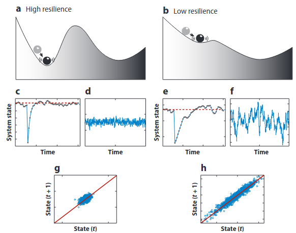

class: top, center

```{r setup, include=FALSE}
options(htmltools.dir.version = FALSE)
```

```{r webcam, echo=FALSE, include= TRUE}
xaringanExtra::use_webcam()
```

```{r xaringan_themes, echo = FALSE, include=FALSE}
	names(xaringan:::list_css())
```

```{r broadcast, echo=FALSE}
xaringanExtra::use_broadcast()
```


# Sumário

.left[


1. Sistemas complexos e dinâmicos
2. Resiliência Ecológica
3. Sistemas sócio-ecológicos
4. Comunidades tradicionais
5. Conhecimento Ecológico local/tradicional
6. Ciclo adaptativo
7. Panarquia
8. Exemplo na Ilha de Santa Catarina
]

.center[
]


---
class: top, center

# Sistemas dinâmicos e complexos

.left[

### Dinâmico

- Muda com o tempo

]

.center[


]

---
class: top, center 

# Problema da complexidade

.left[

### Complexo

- Formado por múltiplos elementos que interagem entre si.
]


*Modelos lineares não levam em conta interações*

---
class: top, left

# Solução qualitativa
##Soluções simples para problemas complexos

- Henri Poincaré: Informações a respeito do comportamento e propriedades de sistemas complexos.

.center[

]

---
# Identidade dos sistemas

.center[


]


---
# Formas como ocorrem as mudanças

.center[

]

--
.center[

]


---

# Resiliência ecológica

### Conceito que ajuda a descrever e entender a dinâmica de sistemas complexos.

- Capacidade que os sistemas possuem de absorver impactos antes de colapsar para um estado alternativo de funcionamento

- Estados alternativos

- Capacidade de auto organização de um sistema (feedbacks)

.center[


C. S. Holling]

Resilience and Stability of Ecological Systems (1973):  https://www.annualreviews.org/doi/10.1146/annurev.es.04.110173.000245

---
# Representação gráfica intuitiva

- Modelo Eurístico

- Duas formas de mudar para um estado alternativo: 1. Impactos pontuais; 2. erosão da resiliência.

.center[

]

--
.center[
]

---
# Resiliência da Engenharia *vs* Resiliência Ecológica

- Após uma perturbação, sistemas demoram certo tempo para retornar para seu estado original.

- Comumente medida como o **tempo de retorno**

.center[

]

---
# Exemplos de florestas e savannas

Florestas e savannas são estados alternativos determinados parcialmente pelo regime de chuvas.

.center[


Hirota et al (2011) - Science: https://science.sciencemag.org/content/334/6053/232

]

---
# Exempo de estados de estabilidade mantidos por perturbações

## Fogo em savannas.
.center[

]

---
# Ciclo adaptativo

- Outro modelo eurístico descrevendo dinâmica de sistemas

- Quatro fases

.center[

]

---
# Panarquia

- Ciclos adaptativos aninhados

- Conexão entre sistemas em escalas diferentes de tempo e espaço

.center[

]


---
# Sistemas sócio-ecológicos (SSE)

## Sistemas que integram ser humano e a natureza de forma indissociável.

### O que conecta os elementos humanos e naturais?

- Serviços ecossistêmicos

- Técnicas de manejo, regras e organizações

- Conhecimento Ecológico Local/Tradicional

.center[


]

---
class: top, left

# Conhecimento Ecológico Local/Tradicional

- Arcabouço de conhecimento de indivíduos de um determinado local

- Baseado na observação e manejo da natureza

- Geralmente passado de geração para geração (longo tempo de observação)

- Pessoas podem identificar mudanças, padrões, elementos locais e suas funções

.center[

]

---
# Resiliência de Sistemas Sócio-Ecológicos

### 1. Interação entre o disturbio, reorganização, sustentabilidade e desenvolvimento

### 2. Foca na capacidade adaptativa, na transformabilidade, no aprendizado e nas inovações


- Transformabilidade é a capacidade de criar um novo sistema com uma nova
maneira de viver

- Adaptabilidade é a capacidade que o sistema possui de controlar a
resiliência, ou seja, lidar e se adaptar aos impactos.


---
class: top, center

# Estudo de caso na Ilha de Santa Catarina como exemplo de SSE
.left[

- Comunidade tradicional de pescadores artesanais

- Como mudou o sistema sócio-ecológico (elementos humanos e naturais)

- Percepção sobre as mudanças climáticas (apresentação à parte)

]

.center[


]

---
# Quadro com mudanças

.center[

]


---
# Efeito cascata e feedbacks

- Todos os aspectos percebidos pelas pessoas e as conexões entre as mudanças

.center[

]

---
# Percepção de mudanças no tempo e no clima
## Índice de extremos climáticos de temperatura


- FishAdapt Conference - Global Conference on Climate Change adaptations for fisheries and acquaculture: http://sdg.iisd.org/events/fishadapt-global-conference-on-climate-change-adaptation-for-fisheries-and-aquaculture/

- Apresentação: https://fishadapt.com/publications/presentations/17-cure.pdf

---
# Indicadores de resiliência

.center[
]

https://sci-hub.se/https://www.annualreviews.org/doi/10.1146/annurev-ecolsys-112414-054242

---
# Atividade Proposta

1. Utilize o *ciclo adaptativo* para descrever a dinâmica de um sistema complexo a sua escolha (sócio-ecológico, ecológico, filosófico, econômico, político, etc). Descreva cada fase do ciclo adaptativo.
.center[

]

2. Fale sobre qual variável de estado pode caracterizar um sistema a sua escolha, dar identidade pra ele, como por exemplo os lagos rasos onde a turbidez era a variável de estado: o lago poderia ser transparente ou poderia estar eutrofizado, ou seja, turvo, em outro estado de estabilidade. Fale sobre as interações (por exemplo práticas de manejo) que conferem estabilidade. Escreva também sobre quais as perturbações poderiam fazer esse sistema mudar sua identidade ou colapsar para um estado alternativo de funcionamento (agentes de mudanças internos e externos). Quais as possíveis formas de reorganização e de adaptação, novidades que podem ser incorporadas (como elementos (a)bióticos novos ou tecnologias). Quais estados alternativos existem ou poderiam existir.

.center[*marciobcure@gmail.com*]

---

# Resgate de pontos importantes

### Resiliência ecológica é uma forma de olhar para os sistemas dinâmicos.

### Resiliência ecológica está associada com:

 - Sistemas complexos e dinâmicos; quer dizer, elementos interagindo e mudando. Equilíbrio dinâmico. Nunca é a mesma coisa, mas as propriedades emergentes continuam as mesmas. Ou a variável de estado oscila em torno de uma mesma média.
 - Possibilidade de estados alternativos;
 - Histerese; Dê um google aí se não lembra o que é isso.
 - Resiliência: não é apenas se recuperar após uma perturbação.
 - É a capacidade de absorver impactos antes de colapsar para um estado alternativo;
 - Está relacionado com a capacidade de auto organização;
 - Também com a capacidade de manter sua identidade e funções; 
 - O que é identidade? Aquilo que caracteriza um sistema. Pode ser a média de longo prazo de alguma variável importante do sistema. A variável de estado. 
 - A variável de estado pode ser descrita de forma qualitativa, mas tb pode ser medida. A turbidez de um rio, por exemplo.
 
---

# Para falar de resiliência...
 
 - Para falar de resiliência de algum sistema é necessário identificar o que dá identidade pra esse sistema?
 - Para falar de resiliência, é preciso identificar resiliência à qual perturbação.
 - Para falar de resiliência é preciso entender o quanto o sistema está sendo forçado e como ele responde às forçantes, além de qual o limite de perturbação que ele vai suportar.

 ## As perturbações são importantes para a dinâmica dos sistemas. Como por exemplo o fogo no cerrado, ou a abertura de clareiras nas florestas para que renove o banco de sementes.
 
---
# Outras referências e leituras complementares

- **Base matemática** -> Non-linear dynamics and chaos: http://arslanranjha.weebly.com/uploads/4/8/9/3/4893701/nonlinear-dynamics-and-chaos-strogatz.pdf

- Principles for Building Resilience: Sustaining Ecosystem Services in Social-Ecological Systems: https://br1lib.org/book/2761925/95b777?id=2761925&secret=95b777

- Generic Indicators of Ecological Resilience: Inferring the Chance of a Critical Transition: https://www.annualreviews.org/doi/abs/10.1146/annurev-ecolsys-112414-054242

- Understanding the Complexity of Economic, Ecological, and Social Systems: https://link.springer.com/article/10.1007/s10021-001-0101-5

- Building Resilience in Lagoon Social–Ecological Systems: A Local-level Perspective: https://link.springer.com/article/10.1007/s10021-005-0140-4

- Dinâmica de um sistema sócio-ecológico na Ilha de Santa Catarina e percepções sobre mudanças no tempo e no clima:  https://repositorio.ufsc.br/bitstream/handle/123456789/189159/PECO0121-D.pdf?sequence=-1&isAllowed=y

---
# Mais referências

- **Conceitos, bibliografias, notícias relacionadas à Sistemas sócio-ecológicos** ->  https://www.resalliance.org

- Resilience Thinking: Integrating Resilience, Adaptability and Transformability - https://www.ecologyandsociety.org/vol15/iss4/art20/

- A capital-based framework for assessing coastal and marine social–ecological dynamics and natural resource management: A case study of Penghu archipelago: https://www.sciencedirect.com/science/article/pii/S2212682114000195

- Ecological resilience - In theory and application: https://sci-hub.se/https://www.annualreviews.org/doi/full/10.1146/annurev.ecolsys.31.1.425

- https://sci-hub.se/https://www.sciencedirect.com/science/article/abs/pii/S0959378006000379

- Shallow lakes theory revisited: various alternative regimes driven by climate, nutrients, depth and lake size - https://link.springer.com/article/10.1007/s10750-007-0616-7
